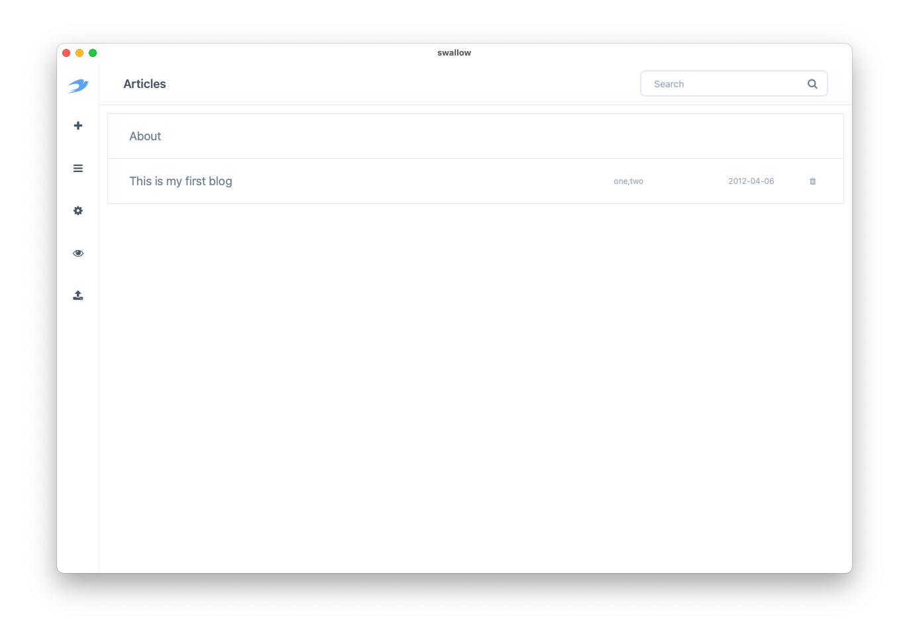
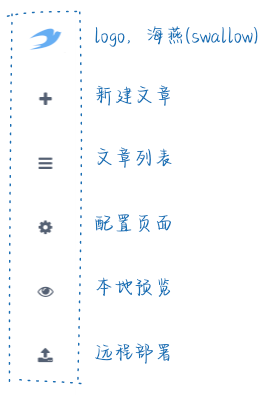
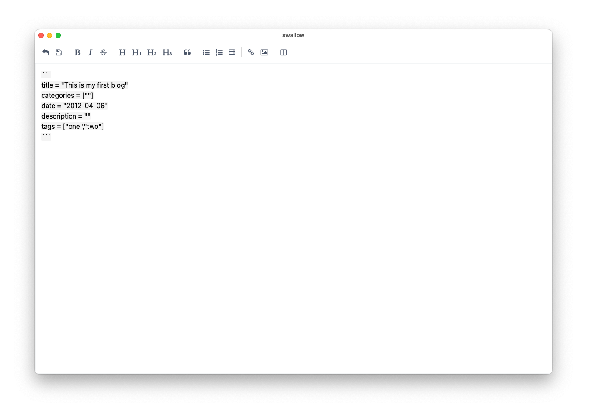
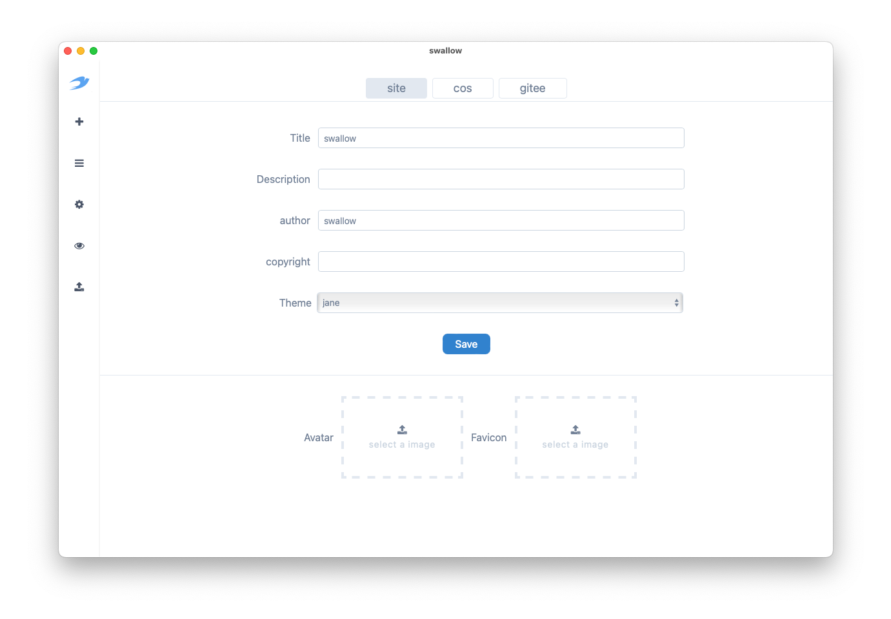

# Swallow

Swallow 是一个简单的静态博客写作客户端。Swallow 的宗旨就是`简单`。即使是一个"小白"用户也可以使用 Swallow 搭建自己的博客系统。使用 Swallow。你不需要懂`HTML`、`CSS`、`Javascript`、`网络`
、`命令行`、`配置文件`等等。

你只需要会使用软件。然后学一点 [Markdown](https://markdown.com.cn/)（一种轻量级标记语言，它允许人们使用易读易写的纯文本格式编写文档）语法。就可以开始创建自己的个人博客网站了。

## 特性

- 使用 Markdown 创作你的博客
- 可以对文章分组和标签
- 支持 Windows 和 MacOS 客户端
- 可以本地预览博客站点
- 可以部署站点到 [COS](https://cloud.tencent.com/product/cos)（腾讯云对象存储服务）
- 可以使用 Hugo 主题，其中内置主题开箱即用
- 本地存储文章源文件。可以备份到 gitee、百度云等平台

## 界面

### 侧边栏说明

### 文章列表

### 文章编辑

### 配置

## 开发

Swallow 使用到的技术也秉承`简单`原则。下面是 Swallow 使用到的主要技术栈：

- [pywebview](https://github.com/r0x0r/pywebview): python GUI 实现
- python：后端编程语言
- HTML/CSS/JS：前端 UI 实现。CSS 使用 `TailwindCSS` 框架，JS 使用 `AlpineJS` 框架
- [Hugo](https://github.com/gohugoio/hugo)：静态网站生成工具

## 其他

作者是一名后端程序员，主要开发语言是 Java 和 Pytho，做过后台、中间件和大数据开发。平时喜欢写写小工具，所以自学了一点前端知识。
这个项目的初衷是给一位小白朋友做一个简单的 Hugo GUI 封装，让他能够使用 Hugo 来创建自己的博客。
项目前期做过很多探索，所以 Swallow 有多个不同版本的实现，有兴趣的可以关注 Swallow 的不同实现，作为学习和讨论。

- [swallos-wails](https://github.com/rangwea/swallow-wails)： 基于 Go 的 [wails](https://wails.io/) 框架开发。
- [swallow-pywebview](https://github.com/rangwea/swallow-pywebview)： 基于 Python 的 [pywebview](https://pywebview.flowrl.com/) 框架开发，前端使用 [alpinejs](https://alpinejs.dev/) 和 [tailwindcss](https://tailwindcss.com/)。
- [swallow-pyside](https://github.com/rangwea/swallow-pyside)： 基于 [Pyside](https://doc.qt.io/qtforpython-6/) 开发。